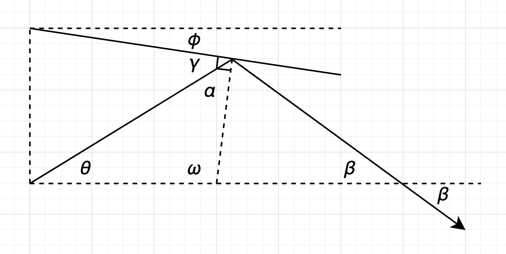
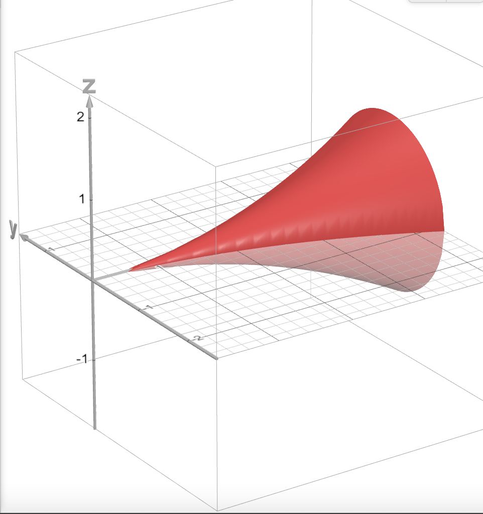

+++
title = "Focusing chamber theoretical analysis 1"
+++

Note: we've actually realized that this is all **completely wrong**. The math is correct, the physics isn't. So this is just for archival purposes.

---

Consider a beam of light that makes an angle $\theta$ with the horizontal. Consider that beam hitting a sloped wall with an angle of declination of $\phi$. Due to Snell's law, the angle the incoming light beam makes with the wall normal is the same as the angle the outgoing light beam makes with the wall normal:

We aim to solve for $\beta$, which is the angle made by the next light beam with the horizontal. To do so, however, we must first calculate the other angles, using the simple geometric fact that $\angle a + \angle b + \angle c = \pi$. First, we calculate $\gamma$:

$$
\left(\frac{\pi}{2} - \theta \right) + \gamma + \left(\frac{\pi}{2} - \phi \right) = \pi
$$
$$
\gamma = \theta + \phi
$$

Then, we calculate $\alpha$:

$$
\alpha = \frac{\pi}{2} - \gamma
$$
Then, we calculate $\omega$:

$$
\omega + \theta + \alpha = \pi
$$
$$
\omega = \frac{\pi}{2} + \phi
$$
Finally, we can calculate $\beta$:

$$
\beta + \alpha + (\pi - \omega) = \pi
$$
$$
\beta = \theta + 2\phi
$$
We can now say that $\beta = \theta_{i + 1}$, as it would be the value of $\theta$ for the next bounce, and the whole setup would repeat. From there, we obtain the equation:

$$
\theta_{i + 1} = \theta_i + 2\phi_i
$$
However, this equation continually increases, whereas what we want is for $\theta_n = 0$ as we want planar waves. Thus, we add a small correction:

$$
\theta_{i + 1} = \theta_i + 2\phi_i
$$
$$
\phi_{i + 1} = \phi_i - i \epsilon
$$
where $\epsilon$ is a suitably small angle. Using this, we find that the resulting curve of $\phi(x)$ is a curve whose derivative is a straight line, and therefore:

$$
f(x) = ax^2
$$

Using $f(10) = 6$ obtained from the equation, we solve for the value $a = \frac{50}{3}$. Therefore, the mathematically ideal surface is a surface of revolution about the x-axis of the curve:

$$
f(x) = \frac{3}{50} x^2
$$

